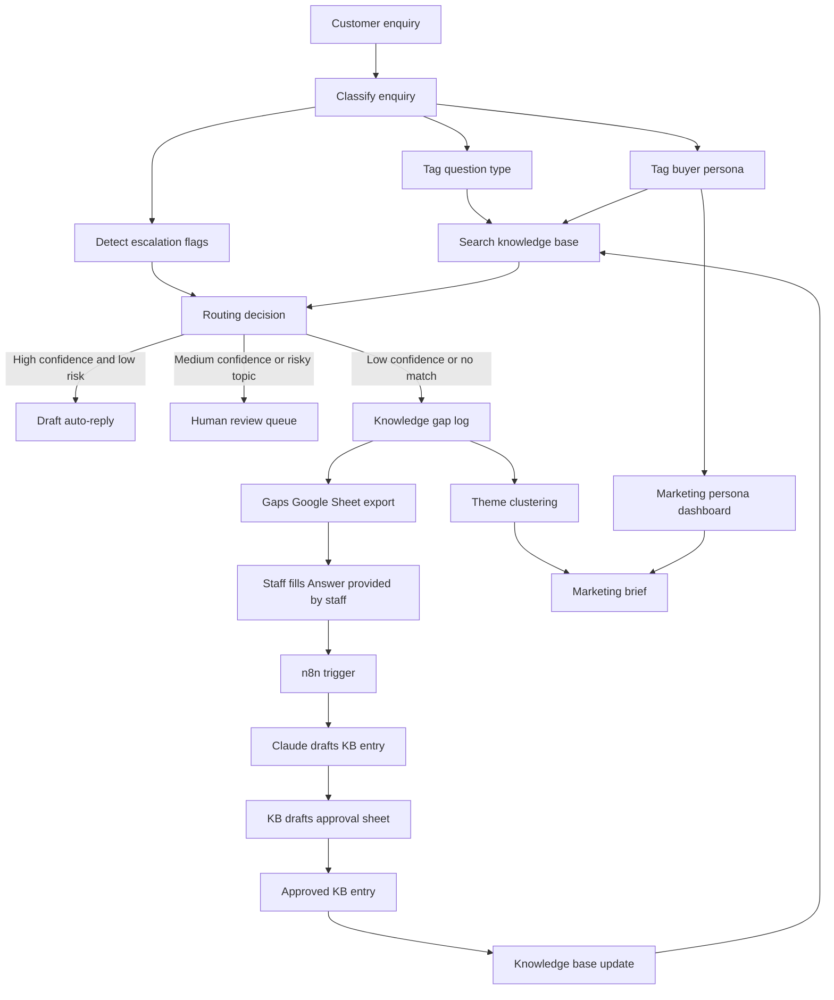
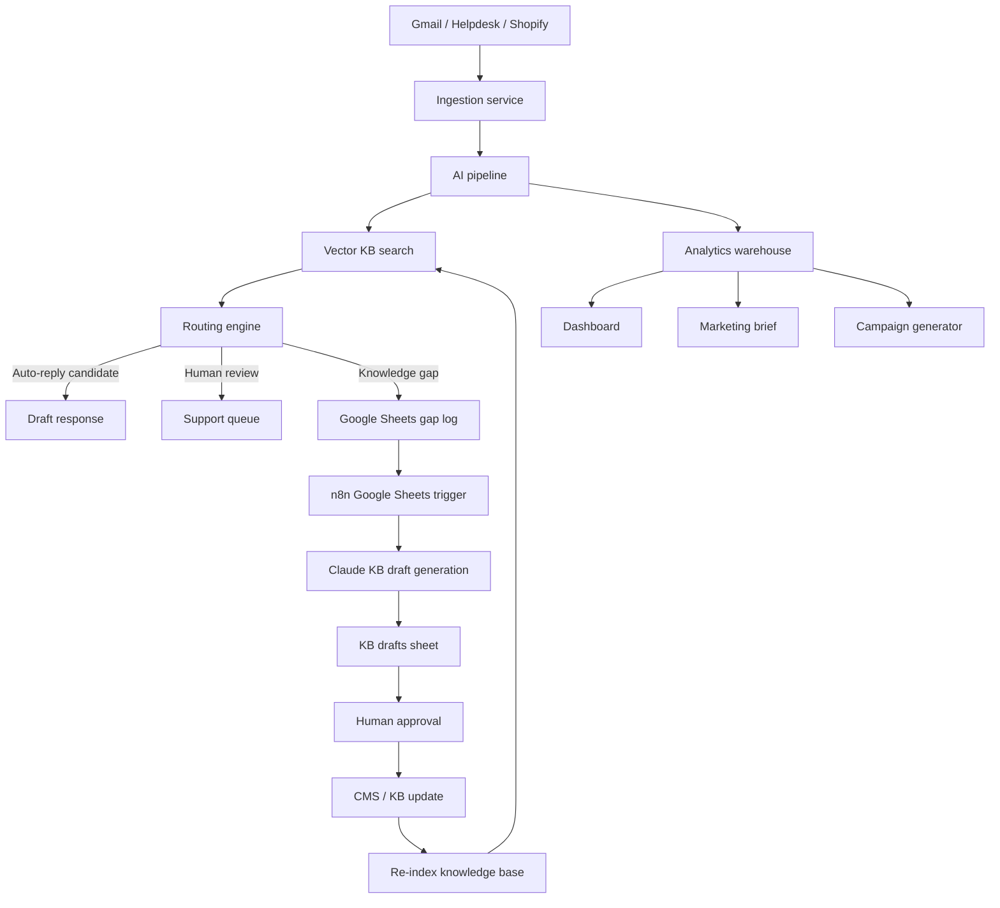

# Boldr Customer Intelligence Engine - Project Handover

Live app: https://boldr-intel.vercel.app

## 1. Executive Summary

This project is a customer intelligence engine for Boldr. It is designed to do more than answer customer enquiries. Every enquiry becomes useful business data.

In simple terms, the system does four jobs:

1. It reads a customer enquiry.
2. It understands what the customer is asking and what type of buyer they are.
3. It searches Boldr's knowledge base and drafts the right response.
4. If the system finds something missing from the knowledge base, it logs that missing topic so the business can improve the knowledge base, product pages, and marketing campaigns.

The main idea is: this is not just a chatbot. It is a self-improving customer intelligence loop.

## 2. What We Built

We built an end-to-end demo system with:

- A customer enquiry processing pipeline.
- A knowledge base retrieval system.
- Buyer persona classification.
- Confidence-based routing.
- Draft customer replies.
- Knowledge gap detection.
- Auto-drafted KB entries for review.
- Marketing campaign ideas by buyer persona.
- Excel and CSV exports for human review.
- A deployed dashboard on Vercel.

The current production deployment is available at:

https://boldr-intel.vercel.app

## 3. The Core Business Problem

Customer support messages contain more value than just support work.

They tell the company:

- What buyers are confused about.
- Which product details are missing from product pages.
- Which personas are asking which questions.
- Which objections are blocking purchase.
- Which topics should become marketing campaigns.
- Which questions need new FAQ or knowledge base entries.

Normally, these signals are lost inside support inboxes. This project captures them automatically.

## 4. How The System Works In Plain English

Imagine a customer writes:

"Is the strap safe for sensitive skin? I have a nickel allergy."

The system does this:

1. It tags the question as `materials_safety`.
2. It tags the buyer as `health_conscious`.
3. It searches Boldr's FAQ, product specs, and strap information.
4. If it finds a good answer, it drafts a reply.
5. If the answer is high confidence and low risk, it can be marked as auto-reply.
6. If the topic is sensitive, like allergies or safety, it sends the draft for human review.
7. It also records that health-conscious buyers care about hypoallergenic and nickel-free materials.
8. That marketing signal can become a newsletter, Instagram post, TikTok post, product badge, or product page improvement.

The same enquiry therefore supports:

- Customer service.
- Knowledge base improvement.
- Product page improvement.
- Marketing strategy.

## 5. Architecture Overview

At a high level, the system has six layers:

1. Data layer
2. Knowledge base layer
3. AI reasoning layer
4. Routing and workflow layer
5. Self-improvement layer
6. Dashboard and export layer

### Architecture Diagram



## 6. Pipeline Architecture

The backend pipeline follows this sequence:

```text
classify
  -> search_kb
  -> decide_route
      -> auto_reply -> draft_reply
      -> human_review -> draft_reply
      -> knowledge_gap -> flag_gap -> auto_draft_kb
```

### Step 1: Classify

The system reads the customer message and extracts:

- `question_type`
- `buyer_persona`
- `escalation_flags`
- `classification_confidence`

The current allowed question types are:

- `order_status`
- `engraving`
- `servicing`
- `strap_compatibility`
- `materials_safety`
- `product_general`
- `knowledge_gap`

The current buyer personas are exactly the five required personas:

- `gifter`
- `health_conscious`
- `enthusiast`
- `active`
- `sustainable`

We removed the extra personas that were not needed for the brief:

- niche buyer
- transactional buyer
- owner aftercare buyer
- prospect

Those older labels were mapped into the five-persona taxonomy.

### Step 2: Search The Knowledge Base

The system searches Boldr's available information:

- FAQ document
- Product specs
- Engraving rate card
- Servicing rate card
- SOP document
- Resolved knowledge gaps

The system gives higher priority to more reliable sources.

For example:

- Rate cards and product specs are treated as highly reliable.
- FAQ entries are reliable for common topics.
- SOP is lower priority because one known SOP price is stale.

This matters because the system must not quote stale or incorrect prices.

### Step 3: Decide The Route

After searching, the system decides what should happen next.

There are three possible routes:

| Route | Meaning |
|---|---|
| `auto_reply` | The system is confident and can draft a reply that is safe to send. |
| `human_review` | The system has useful context but a human should check before sending. |
| `knowledge_gap` | The knowledge base does not have a good enough answer. |

The routing thresholds are:

| Threshold | Value | Meaning |
|---|---:|---|
| High confidence | 0.72 or above | Can be considered for auto-reply. |
| Gap threshold | Below 0.50 | Treat as a knowledge gap. |
| Minimum classification confidence | Below 0.55 | Send to human review. |

Some topics always go to human review even if confidence is high.

Examples:

- Angry customers
- Refund issues
- Fulfilment errors
- Corporate bulk orders
- Press or media requests
- High-liability topics
- Order ID mismatch
- Older model uncertainty
- Order status questions
- Health-conscious buyers asking materials or safety questions

This is intentional. Boldr is a premium brand, so the system is designed to be careful.

### Step 4: Draft Reply

If the enquiry is answerable, the system drafts a reply in Boldr's voice.

The reply uses retrieved KB context and includes internal citations so staff can see which source the answer came from.

### Step 5: Detect Knowledge Gaps

If the KB search returns low confidence or no useful match, the enquiry becomes a knowledge gap.

The gap log records:

- Date
- Ticket ID
- Customer question
- Theme tag
- Persona tag
- KB confidence
- Route reason
- Answer provided by staff
- KB draft status
- KB entry draft
- Review status
- Human notes

This is the part that makes the project a system, not just a chatbot.

### Step 6: Auto-Draft KB Entry

For a knowledge gap, the system can draft a new FAQ-style KB entry.

The draft follows this format:

```text
Q: <Generic customer question>
A: <2-4 sentence answer in Boldr voice>

Section: <FAQ section>
```

The draft is not automatically published. It is prepared for human approval.

## 7. Self-Improving Feedback Loop

The most important product idea is the feedback loop.

The loop is:

```text
Customer asks something new
  -> KB search has low confidence
  -> Gap is logged
  -> Staff adds the correct answer
  -> n8n detects the staff answer
  -> Claude drafts a KB entry
  -> Human approves
  -> KB gets updated
  -> Future customers get better answers
```

We added a specific column for this process:

```text
Answer provided by staff
```

This column is designed for a Google Sheets plus n8n workflow.

Production version:

1. Low-confidence questions are exported to a Gaps Google Sheet.
2. A staff member fills `Answer provided by staff`.
3. n8n watches that column using a Google Sheets trigger.
4. When the column is filled, n8n sends the question and staff answer to Claude.
5. Claude drafts the answer in Boldr's KB format.
6. The result is written into a `KB Drafts` sheet.
7. A human approves or edits it.
8. Approved entries are added back to the knowledge base.

This creates continuous improvement.

## 8. RAG Architecture

RAG means Retrieval-Augmented Generation.

In simple terms:

- The AI does not answer from memory alone.
- It first searches trusted Boldr documents.
- Then it writes an answer using those documents.

This reduces hallucination because the AI has to rely on retrieved source material.

### Python Backend RAG

The Python backend uses:

- ChromaDB as the vector database.
- ChromaDB's embedding function for semantic retrieval.
- Cosine similarity for search.
- Top 5 retrieved chunks.
- Source-priority boosting.

The knowledge base is built from:

- FAQ chunks
- Rate card rows
- Product spec entries
- SOP sections
- Already-resolved gap entries

Each chunk has metadata:

- Source
- Section
- Source priority
- Product SKU if applicable
- Theme if applicable

Source priority helps the system prefer canonical information.

Example:

If the SOP says one price but the official rate card says another, the rate card wins.

### Web App RAG

The deployed Next.js web app uses a deployment-friendly search index:

- BM25 keyword retrieval over `public/data/kb.json`
- Query coverage scoring
- Source-priority boosting
- Top 5 hits

This keeps the Vercel demo lightweight and reliable.

So the project currently has two retrieval implementations:

| Environment | Retrieval method | Purpose |
|---|---|---|
| Python backend | ChromaDB semantic vector search | Full offline pipeline and evaluation. |
| Deployed web app | BM25 search over JSON KB | Fast, dependency-light demo on Vercel. |

Both follow the same business logic:

- Search trusted KB.
- Score confidence.
- Apply source priority.
- Route based on confidence and risk.

## 9. Models Used

The AI model wrapper is configured through OpenRouter.

Default model:

```text
anthropic/claude-sonnet-4.6
```

The model is used for:

- Classifying enquiries.
- Drafting customer replies.
- Paraphrasing knowledge gaps.
- Drafting KB entries.
- Labelling customer question clusters.
- Writing marketing briefs.
- Writing external benchmark analysis.

The model is not trusted blindly.

We added guardrails:

- Valid enum checks for question type.
- Valid enum checks for buyer persona.
- Valid enum checks for escalation flags.
- Confidence clamping.
- Fallback to human review on classification failure.
- Deterministic order-ID mismatch detection.
- Source-priority scoring.
- Human-review routing for risky categories.

## 10. Buyer Persona System

The brief requires five buyer personas. The system now uses only these five.

| Persona | What They Care About | Marketing Angle |
|---|---|---|
| Gifter | Engraving, packaging, birthdays, anniversaries, family gifts | Gift bundles, engraving configurator, seasonal campaigns |
| Health-Conscious Buyer | BPA-free, nickel-free, hypoallergenic, safety certifications | Safety badges, hypoallergenic strap messaging |
| Enthusiast / Collector | Titanium grade, movement, accuracy, specs, straps | Spec deep-dives, limited editions, collector content |
| Active Buyer | Outdoors, swimming, durability, sizing, everyday use | Rugged use-case campaigns, water-ready strap bundles |
| Sustainable Buyer | Vegan materials, recycling, packaging, carbon-neutral shipping | Sustainability page, packaging FAQ, material transparency |

### Persona Reconciliation

The system does not rely only on the model's persona guess.

It also counts trigger keywords from the persona CSV.

Then it uses a confidence-weighted vote:

```text
persona score = keyword hits * 0.4 + model confidence if the model picked that persona
```

This helps prevent the model from ignoring strong keyword evidence.

## 11. Marketing Campaign Engine

The dashboard now shows how each buyer persona can be targeted with campaigns.

For example:

Health-conscious buyer:

- Newsletter: Highlight hypoallergenic, BPA-free, nickel-free strap benefits.
- Instagram post: Visual product badge or safety reassurance.
- TikTok post: Short use-case video explaining sensitive-skin friendly materials.

The purpose is to show content repurposing.

One customer question can become:

- A customer reply.
- A FAQ entry.
- A product page improvement.
- A newsletter.
- An Instagram post.
- A TikTok post.

This is important because it turns support data into scalable marketing content.

## 12. Dashboard Pages

The deployed app includes these main views:

| Page | Purpose |
|---|---|
| Home | Executive overview and self-improving engine summary. |
| Inbox | Processed ticket list and drafted replies. |
| Live | Submit a new enquiry and watch the pipeline run. |
| Gaps | Knowledge gaps, staff-answer workflow, KB drafts export. |
| Themes | Clustered customer question themes. |
| Campaigns | Persona-based campaign ideas and repurposed content. |
| Brief | Marketing brief and Excel export. |
| Bench | External sentiment benchmark. |

## 13. Export Features

We added exports so the system can fit a human review workflow.

### Gaps Sheet Export

Endpoint:

```text
/api/gaps/export
```

Exports a Google-Sheets-ready CSV with:

- Date logged
- Ticket ID
- Question
- Theme tag
- Persona tag
- KB confidence
- Source channel
- Route reason
- Answer provided by staff
- KB draft status
- KB entry draft
- Review status
- Human notes

### KB Drafts Sheet Export

Endpoint:

```text
/api/gaps/kb-drafts/export
```

Exports a CSV for KB draft approval:

- Date created
- Source ticket ID
- Question
- Answer provided by staff
- Theme tag
- Persona tag
- KB entry draft
- Approval status
- Approver notes
- Publish ready

### Marketing Brief Excel Export

Endpoint:

```text
/api/marketing-brief/export
```

Exports an Excel workbook with multiple tabs:

- Overview
- Campaign Matrix
- Segmentation Review
- Knowledge Gaps
- KB Drafts
- Theme Actions
- Persona Reference

This supports human review and correction. If the AI misclassifies a persona, a human can correct it in the workbook.

## 14. Accuracy And Evaluation

The current evaluation is based on 70 sample tickets.

Latest measured baseline:

| Metric | Result | Meaning |
|---|---:|---|
| Question type accuracy | 84.3% | How often the system identifies the correct enquiry category. |
| Buyer persona accuracy | 80.0% | How often the system assigns the correct buyer persona. |
| KB recall when answerable | 88.0% | When the answer exists in the KB, how often the system finds enough evidence. |
| Order ID mismatch detection | 4/4 | The system caught all known order-ID mismatch cases. |
| SOP price drift violations | 0 | The system did not quote the known stale SOP price. |
| Route match rate | 48.6% | Alignment with the simple ground-truth human-vs-auto proxy. |

### Important Caveat About Route Match

The route match score is low because the evaluation uses a simple proxy:

```text
requires_escalation = should not auto-reply
```

But our system is intentionally more conservative.

It sends many cases to human review even if the basic label says they may be answerable. This is a business decision, not only a model weakness.

For a premium brand, this is safer because:

- Order status needs real Shopify checking.
- Materials and safety claims need careful review.
- Angry or refund-related messages need human handling.
- Medium-confidence answers should not be auto-sent.

So the routing system is optimized for brand safety, not maximum automation.

## 15. What The System Is Good At Today

The system is already strong at:

- Classifying common customer support topics.
- Keeping the persona taxonomy to the required five personas.
- Retrieving relevant KB information.
- Avoiding stale SOP price drift.
- Catching order-ID mismatches.
- Separating safe auto-replies from risky human-review cases.
- Detecting knowledge gaps.
- Turning gaps into KB drafts.
- Turning persona signals into campaign ideas.
- Exporting review workbooks for humans.

## 16. Current Limitations

This is still a demo/prototype, not a fully productionized support platform.

Current limitations:

- The live deployed app uses a lightweight BM25 search index instead of the full ChromaDB vector setup.
- The Google Sheets and n8n workflow is represented through export-ready sheets, but the live n8n automation still needs to be wired.
- Staff edits in Google Sheets are not yet synced back automatically into the deployed app.
- The KB approval step is shown as a workflow/export, not yet a real one-click publish into a production CMS.
- The evaluation dataset is 70 tickets, so accuracy numbers are useful but not yet enterprise-grade.
- There is no long-term production monitoring dashboard yet.
- Real Gmail, Shopify, and helpdesk integrations are not connected in this demo.

## 17. How The System Improves Over Time

The system improves in three ways.

### 1. Knowledge Base Improvement

Every low-confidence enquiry becomes a knowledge gap.

Once staff answer it and approve a KB draft, the KB gets stronger.

Result:

- Fewer repeated gaps.
- Better future answers.
- Higher KB confidence.
- Lower human workload over time.

### 2. Persona Intelligence Improvement

Every enquiry is tagged by persona.

Over time, Boldr can see:

- Which personas ask the most questions.
- Which personas create the most gaps.
- Which product pages are underserving each persona.
- Which campaigns should be prioritized.

Result:

- Better segmentation.
- More relevant marketing.
- Better product page messaging.

### 3. Campaign Repurposing Improvement

Each repeated question can become marketing content.

Example:

One support enquiry about hypoallergenic straps can become:

- FAQ entry
- Product page badge
- Newsletter
- Instagram carousel
- TikTok short
- Ad copy

Result:

- More content at lower effort.
- Campaigns grounded in actual customer demand.
- Better alignment between support and marketing.

## 18. Planned Production Architecture

The production version should connect the current demo pieces to real operational systems.



## 19. Recommended Next Steps

### Phase 1: Finish The Feedback Loop

- Connect the Gaps Sheet export to a real Google Sheet.
- Configure n8n to watch `Answer provided by staff`.
- Send completed rows to Claude.
- Write the generated KB entry to a `KB Drafts` sheet.
- Add approval status and publish-ready workflow.

### Phase 2: Production Knowledge Base

- Store approved KB entries in a real KB source.
- Re-index the KB automatically after approval.
- Add version history for KB changes.
- Track which gap created each new KB entry.

### Phase 3: Improve Accuracy

- Expand the labelled evaluation set beyond 70 tickets.
- Add per-persona confusion reports.
- Add per-question-type threshold tuning.
- Compare ChromaDB vector search vs BM25 vs hybrid search.
- Add automated regression tests for known tricky tickets.

### Phase 4: Real Integrations

- Connect Gmail or helpdesk ingestion.
- Connect Shopify for order status verification.
- Connect a CMS or FAQ database for approved KB publishing.
- Connect Google Sheets for human review.
- Connect n8n for automation.

### Phase 5: Marketing Automation

- Generate persona-specific campaign briefs monthly.
- Export campaign ideas to Excel or Google Sheets.
- Add approval workflow for newsletters, Instagram posts, and TikTok scripts.
- Track which customer themes become actual campaigns.

## 20. Why This Is More Than A Chatbot

A normal chatbot answers the customer and stops.

This system keeps learning.

It records what it could not answer. It asks staff to fill the missing answer. It turns that answer into a KB draft. It adds that back into the knowledge base. It also turns repeated customer questions into marketing insights.

That is the difference:

```text
Chatbot:
Customer asks -> AI answers

Boldr Intelligence Engine:
Customer asks -> AI answers or escalates -> gap is logged -> staff resolves -> KB improves -> marketing improves -> future answers improve
```

## 21. Final Summary

We built a deployed self-improving customer intelligence engine for Boldr.

It can:

- Process customer enquiries.
- Classify buyer personas.
- Search the knowledge base.
- Draft customer replies.
- Detect missing knowledge.
- Create KB draft workflows.
- Export review sheets.
- Generate marketing intelligence.
- Show campaign ideas by persona.

Current measured accuracy is strong for a prototype:

- 84.3% question-type accuracy.
- 80.0% persona accuracy.
- 88.0% KB recall when the answer exists.
- 4/4 order-ID mismatch detection.
- 0 stale SOP price violations.

The main improvement path is to connect the current export-ready workflow to real Google Sheets, n8n, Claude drafting, and KB publishing.

Once that loop is connected, the system becomes a continuously improving customer support, knowledge base, and marketing intelligence engine.
